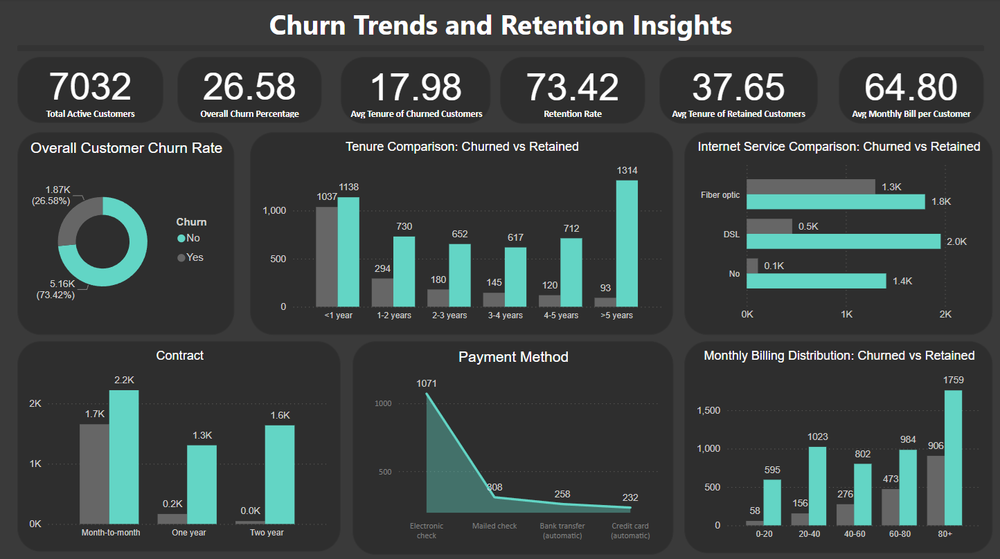
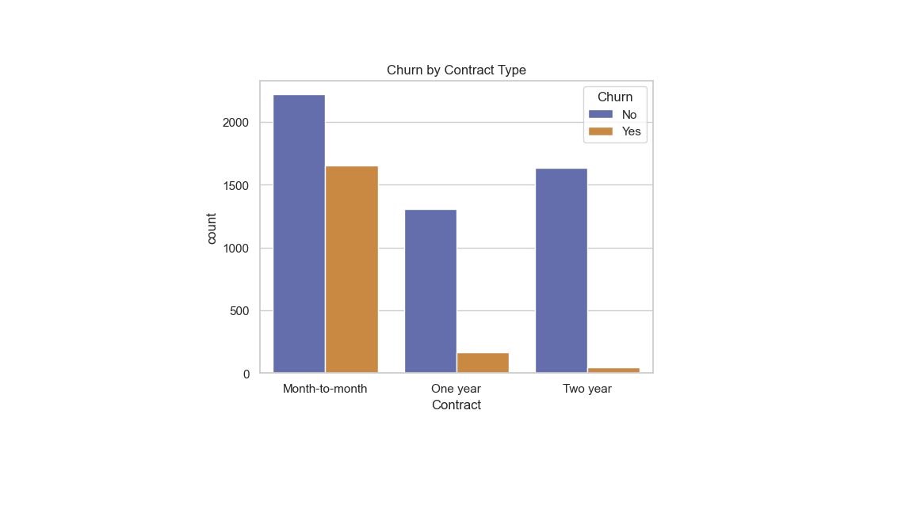
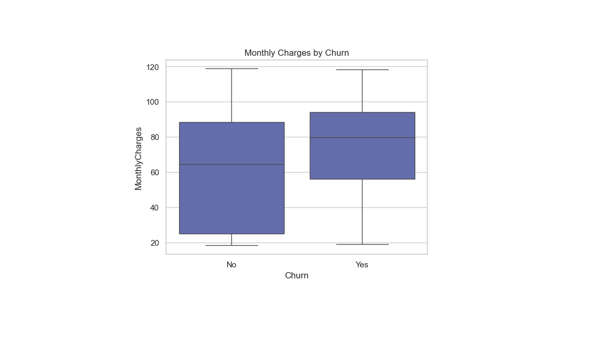

# 📊 Customer Churn Analysis – Power BI & Python Project

This project analyzes customer churn behavior using the Telco Customer Churn dataset. It combines **Python** (for data cleaning and exploration) and **Power BI** (for dashboard development) to uncover insights about customer retention, contract trends, and billing sensitivity.

---

## 📁 Project Files

| File | Description |
|------|-------------|
| `Customer_Churn_Dashboard.pbix` | Interactive Power BI dashboard |
| `churn_analysis.ipynb`          | Jupyter Notebook for Python-based EDA |
| `cleaned_telco_churn.csv`       | Cleaned dataset used for dashboard |
| `/images/`                      | Folder with dashboard and visual screenshots |
| `README.md`                     | Project documentation (this file) |

---

## 🔧 Tools Used

- **Python (pandas, seaborn, matplotlib)** – Data cleaning, visualization
- **Power BI Desktop** – Interactive dashboard
- **DAX** – Churn rate calculation, tenure and billing buckets
- **Jupyter Notebook** – For structured EDA
- **GitHub** – Version control and project showcase

---

## 📊 Dashboard Overview

---

## 📘 Exploratory Data Analysis (Python)

Before building the dashboard, I explored and cleaned the dataset using Python in a Jupyter Notebook.

📄 [`churn_analysis.ipynb`](churn_analysis.ipynb)

Key EDA tasks:
- Cleaned missing values in `TotalCharges`
- Transformed `SeniorCitizen` from numeric to categorical
- Simplified service-related columns (e.g., "No internet service" → "No")

**Example EDA Output:**

## 🧮 Key Metrics

| KPI                    | Description                          |
|------------------------|--------------------------------------|
| Total Customers        | Count of all active customers        |
| Churn Rate (%)         | `(Churned / Total) × 100` (via DAX)  |
| Retention Rate (%)     | `100 - Churn Rate` (via DAX)         |
| Avg Tenure (Churned)   | Average loyalty of churned customers |
| Avg Tenure (Retained)  | Average loyalty of retained customers|
| Avg Monthly Charges    | Billing trend across all customers   |

---

## 🧭 How to Use

1. Download the repository or clone it locally
2. Open the Power BI file: `Customer_Churn_Dashboard.pbix`
3. View the notebook `churn_analysis.ipynb` for the Python workflow

---

## 📂 Dataset Source

- 📄 [Telco Customer Churn Dataset – Kaggle](https://www.kaggle.com/datasets/blastchar/telco-customer-churn)

---

## ✅ Conclusion

This project demonstrates how data analytics can be used to uncover key patterns behind customer churn. Through exploratory analysis in Python and an interactive Power BI dashboard, the following insights were discovered:

- **Churn is highest among customers with month-to-month contracts**, suggesting that long-term plans may encourage retention.
- Customers with **shorter tenure (less than 12 months)** are more likely to churn, indicating a need to improve early customer experience.
- There is a **slight trend of higher churn among customers with higher monthly charges**, suggesting price sensitivity.
- Segmentation using tenure and billing ranges helped identify high-risk groups for churn, enabling more targeted interventions.

The project highlights how combining Python (for data cleaning and exploration) with Power BI (for dashboarding and business storytelling) provides a powerful approach to solving real-world business problems.

---

## 📬 Contact

- 📧 Email: ashishg235@gmail.com
- 🌐 GitHub: [Ashishg235](https://github.com/Ashishg235)
- 🔗 LinkedIn: [linkedin.com/in/ashish-gaur-36b8a78a](https://linkedin.com/in/ashish-gaur-36b8a78a)

---

